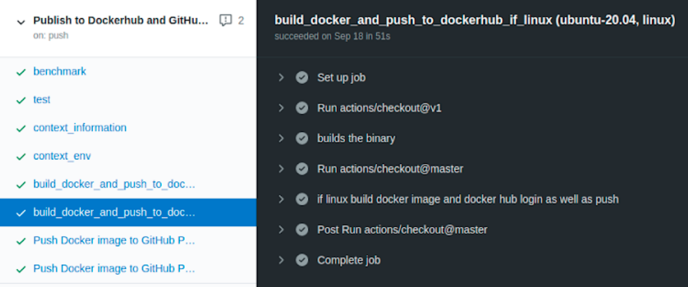

# GitHub Actions - hello ADDO


A repository exploring GitHub Actions to automate Docker deployments.

### Deployment targets

- [Dockerhub](https://hub.docker.com/) - https://hub.docker.com/repository/docker/lotharschulz/hello-github-actions
- [GitHub Container Registry](https://docs.github.com/en/packages/working-with-a-github-packages-registry/working-with-the-container-registry) -  https://github.com/lotharschulz?ecosystem=container&tab=packages
- ([GitHub Docker Registry](https://docs.github.com/en/packages/working-with-a-github-packages-registry/migrating-to-the-container-registry-from-the-docker-registry) - https://github.com/lotharschulz?ecosystem=docker&tab=packages)

## Publish Docker Image to GitHub Container Registry

Publishing to [GitHub Container Registry](https://docs.github.com/en/packages/working-with-a-github-packages-registry/working-with-the-container-registry) requires a [personal access token](https://docs.github.com/en/free-pro-team@latest/developers/apps/about-apps#personal-access-tokens) with these scopes:

- repo (full access)
- write:packages
- delete:packages

Store the _personal access token_ value in a [repository encypted secret](https://docs.github.com/en/actions/reference/encrypted-secrets) (e.g. `CR_PAT`) 

Use the _repository encypted secret_ in a workflow file: `GCR_PASSWORD: ${{ secrets.CR_PAT }}` 

Find the published docker images in _packages type container_: [https://github.com/[username]?ecosystem=container&tab=packages](https://github.com/lotharschulz?ecosystem=container&tab=packages). 
Please note: these images' visibility is _private_.

GitHub actions workflow file: https://github.com/lotharschulz/hello-github-actions/blob/main/.github/workflows/cicd.yml#L209-L228

## Publish Docker Image to GitHub Packages

Publishing Docker Images to GitHub Packages using:

- _build-push-action_: https://github.com/lotharschulz/hello-github-actions/blob/main/.github/workflows/cicd.yml#L160-L189
- _docker cli_: https://github.com/lotharschulz/hello-github-actions/blob/main/.github/workflows/cicd.yml#L191-L207

Find the published docker images in _packages type docker_: [https://github.com/[username]?ecosystem=docker&tab=packages](https://github.com/lotharschulz?ecosystem=docker&tab=packages). These images' visibility is _public_.

See also [Publishing Docker images](https://docs.github.com/en/actions/guides/publishing-docker-images).


## CI/CD with Github actions

This repository contains a workflow to
- test the go code
- benchmark the go code
- builds a docker image & uploads it to dockerhub


All that is defined in _[cicd.yml](.github/workflows/cicd.yml) file_.

 

### Talks & Presentations

- Open Source CI/CD Components for GitHub Actions - [All Day DEv Ops, online 2021](https://www.lotharschulz.info/wp-content/uploads/Screenshot_2021-10-26_09-14-13-1024x576.png) (remote). Slides: [ls.info Open Source CI/CD Components for GitHub Actions.pdf](https://www.lotharschulz.info/wp-content/uploads/Open-Source-CI_CD-Components-for-GitHub-Actions-ADDO-2021-10-28_.pptx.pdf)
- CI/CD with GitHub Actions - deploy Docker image to Dockerhub and GitHub Container Registry - [DevOpsCon, London 2021](https://www.lotharschulz.info/wp-content/uploads/Bildschirmfoto-2020-11-25-um-11.53.56-1024x657.png) (remote). Slides: [ls.info CI/CD with GitHub Actions.pdf](https://www.lotharschulz.info/wp-content/uploads/CI_CD-with-GitHub-Actions-DevOpsCon-London-2021-04-21__.pdf)
- Open Source CI/CD components for GitHub Actions - [Fossasia Summit 2020](https://www.lotharschulz.info/wp-content/uploads/Screenshot_2020-03-14_08-35-27_.png) (remote). Slides: [ls.info Open-Source-CI_CD-components-for-GitHub-Actions-Fossasia-Summit-2020.pdf](https://www.lotharschulz.info/wp-content/uploads/Open-Source-CI_CD-components-for-GitHub-Actions-Fossasia-Summit-2020.pdf)
- Continuous Integration & Delivery with GitHub Actions - [Auto Code EU](https://www.auto-code.eu/sessions/solution-keynote-ci-cd-with-github-actions/). Slides: [ls.info CI/CD with GitHub Actions Auto Code Nov 2019.pdf](https://www.lotharschulz.info/wp-content/uploads/CI_CD-with-GitHub-Actions-Auto-Code-Nov-28th-2019.pdf)

### Blog Post

**[CI/CD with GitHub Actions v2](https://www.lotharschulz.info/2019/08/26/ci-cd-with-github-actions-v2/)**

### make file targets

#### build
```shell
make build
```

#### test
```shell
make test
make benchmark
```

#### run
```shell
make run
```

### build docker image
```shell
make build.docker
```

### clean
```shell
make clean
```
