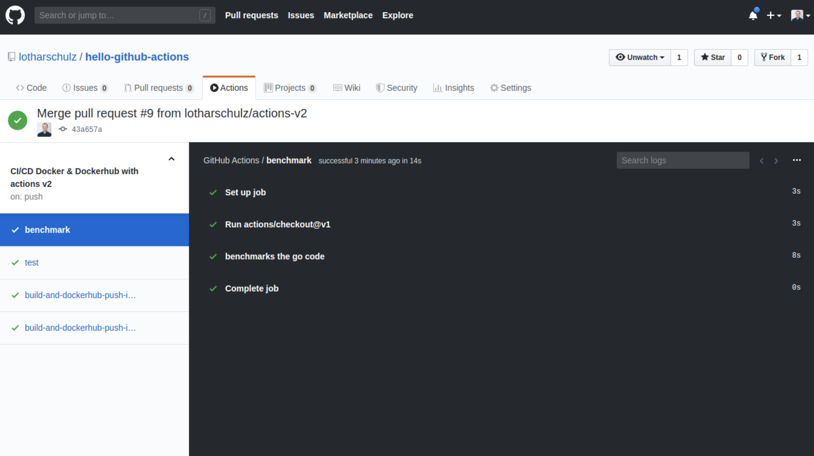

# GitHub Actions


A repository exploring GitHub Actions that serves 2 explorations:

- [Customize Docker Image Tags for GitHub Docker Packages](https://www.lotharschulz.info/2020/07/23/github-packages-docker-image-tags-customization-with-github-actions)
- [CI/CD with Github actions](https://www.lotharschulz.info/2019/08/26/ci-cd-with-github-actions-v2/)

## Publish Docker Image to GitHub Container Registry

Publishing to [GitHub Container Registry](https://docs.github.com/en/free-pro-team@latest/packages/getting-started-with-github-container-registry/about-github-container-registry) requires a [personal access token](https://docs.github.com/en/free-pro-team@latest/developers/apps/about-apps#personal-access-tokens) with these scopes:
- repo (full access)
- write:packages
- delete:packages
Store the _personal access token_ value in a [repository encypted secret](https://docs.github.com/en/free-pro-team@latest/actions/reference/encrypted-secrets) (e.g. `CR_PAT`) 

Use the _repository encypted secret_ in a workflow file: `GCR_PASSWORD: ${{ secrets.CR_PAT }}` 

Find the published docker images in _packages type container_: [https://github.com/[username]?ecosystem=container&tab=packages](https://github.com/lotharschulz?ecosystem=container&tab=packages)

GitHub actions workflow file: https://github.com/lotharschulz/hello-github-actions/blob/main/.github/workflows/cicd.yml#L209-L228

(Note: GitHub Container Registry is currently in public beta)

## Publish Docker Image to GitHub Packages

Publishing Docker Images to GitHub Packages using:

- _build-push-action_: https://github.com/lotharschulz/hello-github-actions/blob/main/.github/workflows/cicd.yml#L160-L189
- _docker cli_: https://github.com/lotharschulz/hello-github-actions/blob/main/.github/workflows/cicd.yml#L191-L207

Find the published docker images in _packages type docker_: [https://github.com/[username]?ecosystem=docker&tab=packages](https://github.com/lotharschulz?ecosystem=docker&tab=packages)


See also [Publishing Docker images](https://docs.github.com/en/actions/language-and-framework-guides/publishing-docker-images) for more details.


## CI/CD with Github actions

[Since August 8th 2019 _GitHub Actions includes built-in CI/CD_](https://twitter.com/github/status/1159511691480260608). Version 2 of this repository is executing the same CI/CD workflow as the first version <sup>[1](https://www.lotharschulz.info/2019/05/09/ci-cd-with-github-actions/), [2](https://twitter.com/lothar_schulz/status/1159513737142898689), [3](https://www.linkedin.com/posts/lotharschulz_github-actions-now-with-built-in-cicd-happily-activity-6565279455458152448-ECh1) </sup>.

This repository contains one version2 workflow to
- test the go code
- benchmark the go code
- builds a docker image & uploads it to dockerhub
All that is defined in _[cicd.yml](.github/workflows/cicd.yml) file_.

 

### Blog Post

**[CI/CD with GitHub Actions v2](https://www.lotharschulz.info/2019/08/26/ci-cd-with-github-actions-v2/)**

### Presentation

- **Open Source CI/CD components for GitHub Actions** - [Fossasia Summit 2020](https://www.lotharschulz.info/wp-content/uploads/Screenshot_2020-03-14_08-35-27_.png) (remote). Find the slides here: [ls.info Open-Source-CI_CD-components-for-GitHub-Actions-Fossasia-Summit-2020.pdf](https://www.lotharschulz.info/wp-content/uploads/Open-Source-CI_CD-components-for-GitHub-Actions-Fossasia-Summit-2020.pdf)
- **Continuous Integration & Delivery with GitHub Actions** - [Auto Code EU](https://www.auto-code.eu/sessions/solution-keynote-ci-cd-with-github-actions/). Find the slides here: [ls.info CI_CD-with-GitHub-Actions-Auto-Code-Nov-28th-2019.pdf](https://www.lotharschulz.info/wp-content/uploads/CI_CD-with-GitHub-Actions-Auto-Code-Nov-28th-2019.pdf)

### make file targets

#### build
```
make build
```

#### test
```
make test
make benchmark
```

#### run
```
make run
```

### build docker image
```
make build.docker
```

### clean
```
make clean
```

neue zeile
